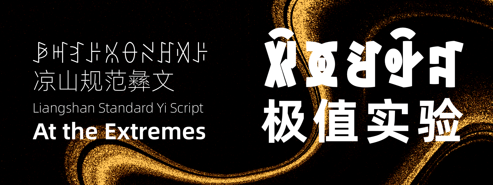

<h1 align="center">
  <picture>
    
  </picture>
</h1>

This repository hosts the Niepsha Cursive font design project for standard Liangshan Yi script. It also tracks terminology translation and documentation for Yi-script typography and graphic design.

1. [Download](#download)
2. [Design Rationale & Goals](#design-rationale--goals)
3. [Glossary](#glossary)
4. [Changelog](#changelog)
5. [License](#license)
6. [Feedback](#feedback)

## Download
- Beta fonts will be placed in `BetaVersion/`.
- Media assets for documentation live in `Doc/Image/`.

## Design Rationale & Goals
ꀋꃋꄚꄆꌅꉁꈾꌊꆀꄯꒉꍑꄻꅍꇬꌬꌠꆈꌠꁱꂷꈧꌠ，ꇿꑌꁱꂷꃚꐨꀁꃚꇨ。ꈛꑌꃅꉜꇬꉌꈲꁱꂷꌊꆀꐯꀋꄮ，ꋍꂷꀉꃚꇨꋍꂷꀁꃚꇨ。ꀊꎴꃅꉜꇬꅉꆈꌠꁱꂷꉜꀋꐚꇬꎷ。ꑠꅹ，ꉢꀋꃅꋌꃢꎖꄎꇬꈍꃅꆈꌠꁱꂷꁱꉻꄻꌊꀉꃚꌐꌠꋒꃯꄉꀐ。

ꋍꈭꐨꒈꀐꏭꆈꌠꃅꄷꉹꁌꌫꏦꈉꐨꀉꑌꌠꇎꈴꂿꄷꄉ，ꁱꂷꃚꐨꀁꃚꌠꑌꄻ，ꇇꁱꌠꐯꅑꋽꀺꇐꌠꑌꄻꀐ。

ꇇꁱꀺꇐꅿꎖꄎꍬꄻꌠꆹꀒꎂꆈꌠꁱꂷꐧꂥꎖꉚꂘꃀ[]ꀙꀉꇨꌠꌊꁱꎼꇁꌠꆈꌠꁱꂷꈧꌠꉜꉚ，ꁱꄟꐮꋒꌠꆈꌠꁱꂷꆿꑐꁱꅍꌊꁱꎼꇁꈧꌠꉜꉚꌠꀋꉬ，ꋍꒉꄸꆹꎖꄎꅍꋋꈨꁭꀊꅰꌬꍩꐥꎻ，ꌶꌺꄚꁱꂷꐛꉻꋋꈧꊌꂿꈧꌠꁳꀊꅰꌫꉚꁌꐨꐥꎻ。

在电子设备和印刷出版物上使用的当代彝文字体，字重普遍严重偏小。近看和汉字不搭调，一个过胖一个过于瘦。远看则经常看不清彝文。因此，我在这次的设计中实验了如何把规范彝文字形做到最粗。

同时为了满足北部彝区群众多样化的使用需求，既做了极细的字重，也做了连贯灵动的手写风格。

手写风格的设计重点参考了西昌本地中高考彝语文辅导老师【名字】用硬笔书写的彝文的样子，而不是参考书法比赛里用毛笔画出来的样子。这样做的目的是让设计更实用，对看到这个字体的学生有更多的参考学习价值。

## Glossary
See `Glossary.md` for the current terminology list.

## Changelog
See `CHANGELOG.md` for version history and release notes.

## License

您可以使用和复制本字体，并免费将其用于个人和商业用途。
使用时请遵守当地法律法规，在任何情况下，本字体开发者都不对任何索赔、损害和其他责任负责。

ꆏꁱꂷꐛꉻꋋꈧꌫꄻ、ꌡꄻꉆ，ꑲꆀꁌꀋꁵꃅꊨꏦꌊꆀꃼꇇꑘꃆꂮꌬꉆ。
ꌫꄻꄮꇬꃅꄷꇬꏦꃤꍬꑲꆀꍑ，ꌤꑞꅐꄿꂿ，ꁱꂷꐛꉻꄻꊿꑟꃣꈌ、ꉮꐪꌊꆀꀉꁁꑠꇬꆼꀋꎍ。

## Feedback
欢迎大家免费下载试用，给我们留言提建议。

ꉪꐋꀨꐥꊈꑢꌬꌠꋨꏦ，ꊏꅇꁱꉪꁳꉪꐨꉉꌠꉘꇉ。
